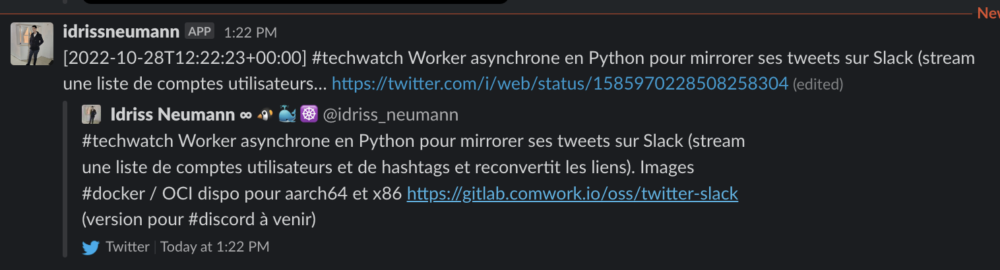
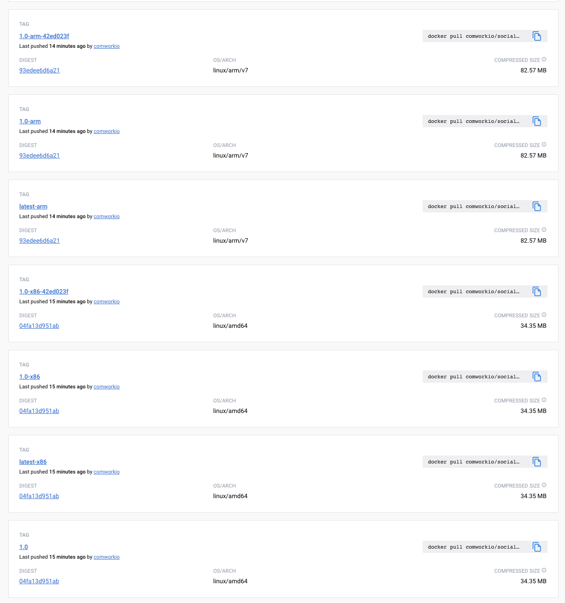

# Social bridge

A python asynchronous worker which subscribe to twitter or mastodon accounts and hashtags and send them to [Slack](https://slack.com), [Discord](https://discord.com), [Mastodon](https://mastodon.social) or [Uprodit](https://www.uprodit.com).



It pulls the twitter API every minutes (you can configure the pool period in the environment's variables) and filter the result to a list of twitter accounts and hashtags.

It also uses redis for storing tweets already processed during 48h (you can configure the TTL in the environment variables).

## Environment's variables

The variables available are listed in the [.env.dist](./.env.dist) file.

Notes:
* The difference between `SLACK_TOKEN` and `SLACK_PUBLIC_TOKEN_X` is the following: the errors will also be published with `SLACK_TOKEN`.
* In order to use discord instead of slack, you just have to replace the variable `SLACK_TOKEN` by `DISCORD_TOKEN` or `SLACK_PUBLIC_TOKEN_X` by `DISCOVER_PUBLIC_TOKEN_X`. You can also use both (you'll have to define all variables).
* `STREAM_PRIMARY_SRC` indicate the primary source and can take `twitter` or `mastodon` as value in order to avoid infinite loop (default `twitter`)
* Every accounts defined with the `TWITTER_OWNER_X` environments variables muste be also defined with the `TWITTER_USERNAME_X` environments variables. Only the owners will be able to be mirrored on Mastodon, Twitter or Uprodit (the username that are not owner will be mirrored on Slack or Discord with a `From {{username }} at {{ date_iso }}` mention).

## Git repositories

* Main repo: https://gitlab.comwork.io/oss/social-bridge
* Github mirror: https://github.com/idrissneumann/social-bridge.git
* Gitlab mirror: https://gitlab.com/ineumann/social-bridge.git
* Froggit mirror: https://lab.frogg.it/ineumann/social-bridge.git

## Image on the dockerhub

The image is available and versioned here: https://hub.docker.com/r/comworkio/social-bridge

You'll find tags for arm32/aarch64 (optimized for raspberrypi) and x86/amd64 tags:



## Getting started

```shell
$ cp .env.dist .env # replace the environment values in this file
$ docker-compose -f docker-compose-local.yml up --force-recreate
```

And if you want to change the python sources, don't forget to rebuild:

```shell
$ cp .env.dist .env # replace the environment values in this file
$ docker-compose -f docker-compose-local.yml up --force-recreate --build
```
